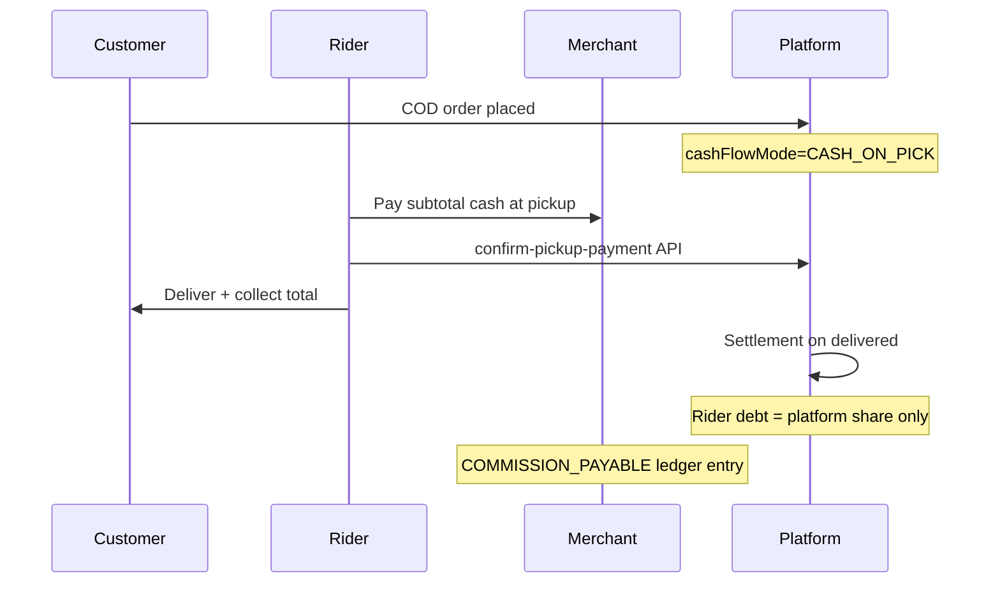
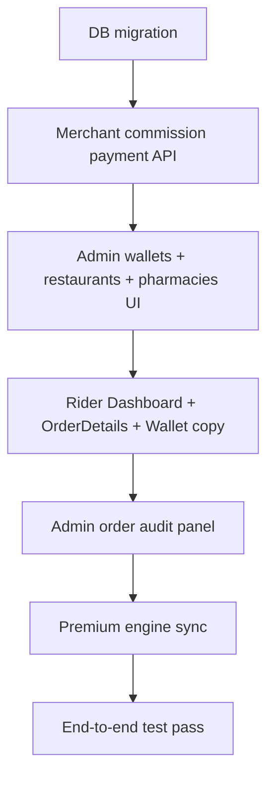

# Cash-on-Pick Implementation — Completion Plan

## Current State (Already Done)

Core backend and rider pickup flow is **~75% complete** from the prior session:


| Layer                                                                                                                     | Status |
| ------------------------------------------------------------------------------------------------------------------------- | ------ |
| Entities: `allowsCreditOrders`, `pickupPaymentStatus`, `COMMISSION_PAYABLE`                                               | Done   |
| Order create defaults to `CASH_ON_PICK`; resolved via `[resolveCashFlowMode()](backend-api/src/orders/orders.service.ts)` | Done   |
| APIs: `POST /orders/:id/confirm-pickup-payment`, `GET /orders/:id/cash-flow-info`                                         | Done   |
| Settlement guards in `[finance.service.ts](backend-api/src/finance/finance.service.ts)` + ledger `COMMISSION_PAYABLE`     | Done   |
| Rider `[NavigationScreen.tsx](mobile-rider-app/src/screens/NavigationScreen.tsx)`: pay-shop banner, confirm-before-pickup | Done   |
| Admin vendors toggle, orders badge, finance KPI                                                                           | Done   |
| Merchant CMS commission payable display                                                                                   | Done   |





---

## Remaining Gaps (Must Complete

### 1. Admin merchant settings — restaurants and pharmacies

Backend entities/DTOs exist, but UI is **only on vendors page**.

- Add `allowsCreditOrders` toggle to `[admin-panel/src/app/restaurants/page.tsx](admin-panel/src/app/restaurants/page.tsx)` (form + edit load/save)
- Add same toggle to `[admin-panel/src/app/pharmacies/page.tsx](admin-panel/src/app/pharmacies/page.tsx)`
- Default remains **OFF** (Cash on Pick) — matches your trust-building strategy

### 2. Rider pre-accept visibility

Riders should know **before accepting** that they must pay the shop.

- `[mobile-rider-app/src/screens/DashboardScreen.tsx](mobile-rider-app/src/screens/DashboardScreen.tsx)`: show green **"Cash on Pick"** chip on pending order cards when `order.cashFlowMode === 'CASH_ON_PICK'`
- `[mobile-rider-app/src/screens/OrderDetailsScreen.tsx](mobile-rider-app/src/screens/OrderDetailsScreen.tsx)`: fetch `getCashFlowInfo` and show:
  - Amount to pay shop (`orderSubtotal` / per-stop breakdown)
  - Amount to collect from customer (if COD)
  - Warning: "You owe platform commission + fee only, not full order total"

### 3. Rider wallet clarity

`[WalletScreen.tsx](mobile-rider-app/src/screens/WalletScreen.tsx)` already shows COD debt — update copy to distinguish modes:

- **Cash on Pick:** "Platform settlement due (commission + fee)"
- **Credit order (future):** "Full order cash collected — remit to platform"

No backend change needed; use existing `codOutstanding` + optional note from summary.

### 4. Admin order audit panel

`[admin-panel/src/app/orders/page.tsx](admin-panel/src/app/orders/page.tsx)` shows list badge but **detail drawer lacks pickup audit**.

Add to selected order panel:

- Cash flow mode badge (already on list)
- Per sub-order: pickup payment status, amount, confirmed timestamp
- Order-level pickup status for single-stop mart/rashan orders

Data already returned by `GET /orders/all` (includes `subOrders` + new columns).

### 5. Merchant commission payment workflow (critical gap)

CMS says *"Pay via admin panel"* but **no API exists to record merchant commission payment**.

Add to `[finance.service.ts](backend-api/src/finance/finance.service.ts)` + `[finance.controller.ts](backend-api/src/finance/finance.controller.ts)`:

```
POST /finance/admin/record-merchant-commission-payment
Body: { vendorId, amount, referenceId, description? }
```

Ledger entry:

- `COMMISSION_PAYABLE` **CREDIT** on merchant wallet (reduces payable balance)

Admin UI in `[admin-panel/src/app/wallets/page.tsx](admin-panel/src/app/wallets/page.tsx)`:

- Show `commissionPayable` per vendor wallet (from extended wallet list or vendor summary)
- Button: "Record Commission Payment" with amount + bank/JazzCash reference

### 6. Production database migration

Dev uses `synchronize: true` in `[app.module.ts](backend-api/src/app.module.ts)`; production needs explicit migration.

Generate migration adding:

- `allows_credit_orders` on `vendors`, `restaurants`, `pharmacies` (default `false`)
- `pickup_payment_`* columns on `orders` and `sub_orders`
- Change `orders.cash_flow_mode` default to `CASH_ON_PICK`
- Extend `financial_ledger_entries.account_tag` enum with `COMMISSION_PAYABLE`

Optional data backfill script:

- Set `cash_flow_mode = 'CASH_ON_PICK'` on all non-delivered pending orders still on `MERCHANT_CREDIT`

### 7. Premium engine sync (low priority)

`[finance-engine-premium.ts](backend-api/src/finance/finance-engine-premium.ts)` still uses old vendor credit/debit pair for `CASH_ON_PICK`. Align with primary engine (`COMMISSION_PAYABLE` only) to avoid divergence if premium endpoints are ever used.

---

## Implementation Order




---

## End-to-End Test Checklist

1. **New mart order (COD)** → `cashFlowMode = CASH_ON_PICK` on create
2. **Rider accepts** → sees pay-shop amount on OrderDetails
3. **At pickup** → confirm payment blocked until rider confirms; then `picked_up` allowed
4. **Deliver** → settlement runs; rider `cashInHand` increases by **platform share only** (not full total)
5. **Merchant statement** → shows `COMMISSION_PAYABLE` debit entry
6. **Admin finance** → `merchantCommissionReceivable` KPI increases
7. **Admin records commission payment** → merchant payable decreases
8. **Enable `allowsCreditOrders` on one vendor** → new orders from that vendor use `MERCHANT_CREDIT` (future-ready)
9. **Cancel delivered order** → contra-accounting reverses `COMMISSION_PAYABLE` entries

---

## Files to Touch (Summary)

**Backend**

- `[backend-api/src/finance/finance.service.ts](backend-api/src/finance/finance.service.ts)` — `recordMerchantCommissionPayment()`
- `[backend-api/src/finance/finance.controller.ts](backend-api/src/finance/finance.controller.ts)` — new admin endpoint
- `[backend-api/src/finance/dto/finance-ops.dto.ts](backend-api/src/finance/dto/finance-ops.dto.ts)` — payment DTO
- New migration under `backend-api/src/migrations/`

**Admin Panel**

- `[admin-panel/src/app/restaurants/page.tsx](admin-panel/src/app/restaurants/page.tsx)`
- `[admin-panel/src/app/pharmacies/page.tsx](admin-panel/src/app/pharmacies/page.tsx)`
- `[admin-panel/src/app/wallets/page.tsx](admin-panel/src/app/wallets/page.tsx)`
- `[admin-panel/src/app/orders/page.tsx](admin-panel/src/app/orders/page.tsx)`

**Rider App**

- `[mobile-rider-app/src/screens/DashboardScreen.tsx](mobile-rider-app/src/screens/DashboardScreen.tsx)`
- `[mobile-rider-app/src/screens/OrderDetailsScreen.tsx](mobile-rider-app/src/screens/OrderDetailsScreen.tsx)`
- `[mobile-rider-app/src/screens/WalletScreen.tsx](mobile-rider-app/src/screens/WalletScreen.tsx)`

**Optional**

- `[backend-api/src/finance/finance-engine-premium.ts](backend-api/src/finance/finance-engine-premium.ts)`

