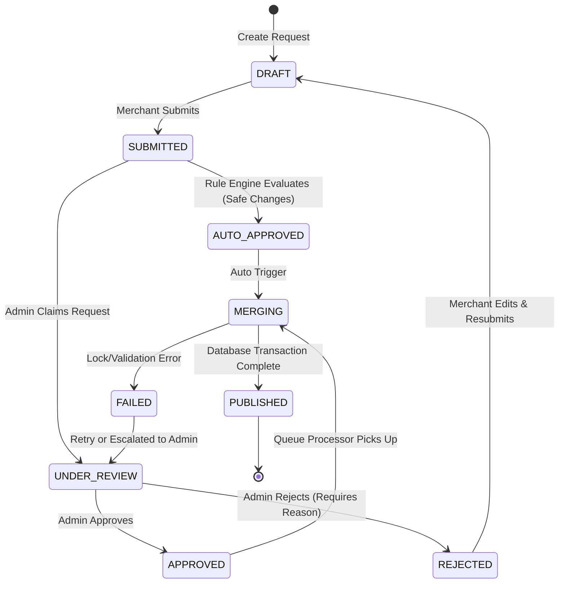
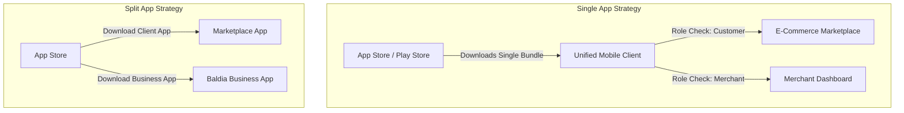
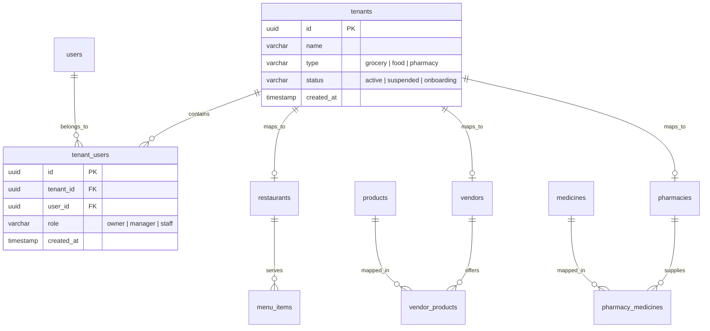
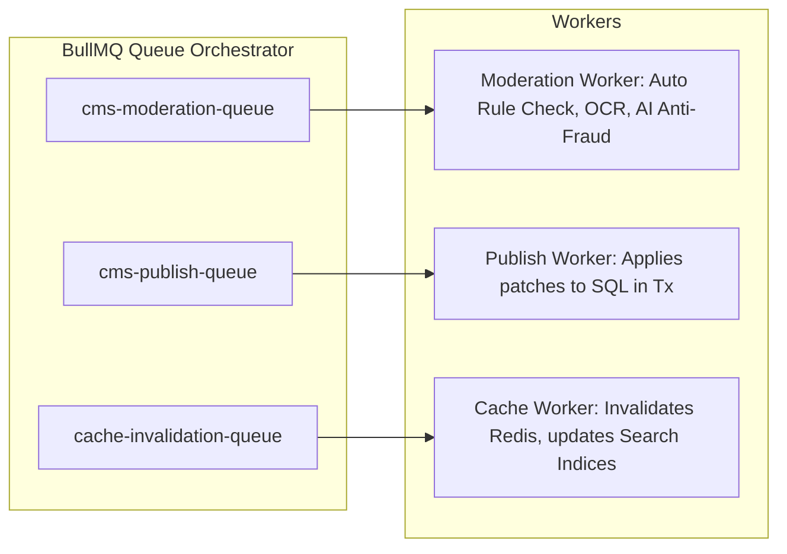

# Baldia Mart – Multi-Tenant Business CMS & Approval Workflow Architecture

This document provides a comprehensive enterprise architecture review and database design for introducing a multi-tenant, role-based Business CMS and a generic Approval Workflow Engine directly inside the Baldia Mart ecosystem.

---

## 1. CMS Architecture: Shared Core vs. Separate Modules

To handle three distinct business verticals (**General Marketplace/Vendors**, **Restaurants**, and **Pharmacies**), the system must choose between entirely decoupled modules or a shared core framework. 

### The Recommended Approach: Hybrid Shared Core with Vertical-Specific Modules
We recommend a **Shared Core Framework** for cross-cutting concerns (authentication, tenant boundaries, media upload, change requests, auditing) combined with **Vertical-Specific Plugins (Modules)** for domain-specific business logic.

```mermaid
graph TD
    subgraph Client Layer
        MobileApp[React Native Mobile App]
    end

    subgraph API Gateway / NestJS Routing
        AuthGuard[Auth & Tenant Guard]
    end

    subgraph Shared Core CMS Module
        CR_Engine[Change Request Engine]
        RBAC_Engine[RBAC & Policy Service]
        RuleEngine[Auto-Approval Rule Engine]
        AuditLog[Audit & History Manager]
    end

    subgraph Vertical Modules
        MartCMS[Mart/Vendor CMS]
        RestCMS[Restaurant CMS]
        PharmaCMS[Pharmacy CMS]
    end

    subgraph Core Entities
        ProdCatalog[(Products Catalog)]
        MenuCatalog[(Menu Items)]
        MedCatalog[(Medicines Catalog)]
    end

    MobileApp -->|Requests| AuthGuard
    AuthGuard --> Shared Core CMS Module
    Shared Core CMS Module --> MartCMS
    Shared Core CMS Module --> RestCMS
    Shared Core CMS Module --> PharmaCMS
    MartCMS --> ProdCatalog
    RestCMS --> MenuCatalog
    PharmaCMS --> MedCatalog
```

### Rationale
* **DRY Code & Governance**: Writing separate approval validation, state transitions, and audit-logging modules for each of the three verticals introduces massive code duplication and increases the risk of security discrepancies. A shared approval core guarantees that no team or vertical can bypass governance rules.
* **Vertical Flexibility**: A pure, rigid shared model fails because a Restaurant Menu Item (preparation time, custom category, availability) has totally different attributes than a Medicine (expiry, active pharmaceutical ingredient, Rx requirements). Domain modules plug into the core approval engine by defining custom JSON schemas and merge handlers.

---

## 2. RBAC (Role-Based Access Control) Design

To enforce tenant boundaries and operations hierarchies, we define a structured RBAC matrix. 
Users are associated with roles at either the **Global Admin** level or the **Tenant Business** level.

### RBAC Hierarchy
* **Global Admins**: Super Admin $\rightarrow$ Operations Manager $\rightarrow$ Product Manager
* **Tenant (Business) Users**: Owner $\rightarrow$ Manager/Pharmacist $\rightarrow$ Staff/Cashier/Assistant Pharmacist

### Permissions Matrix

| Role | View Analytics | Manage Staff | Edit Store Profile | Trigger Change Request | Direct Edit Stock/Availability | Approve Change Requests | Override Pharma Rx Checks | Configure System Rules |
| :--- | :---: | :---: | :---: | :---: | :---: | :---: | :---: | :---: |
| **Super Admin** | Yes | Yes | Yes | Yes | Yes | Yes | Yes | Yes |
| **Operations Manager** | Yes | No | Yes | Yes | Yes | Yes | No | No |
| **Product Manager** | Yes | No | No | Yes | Yes | Yes (Catalog only) | No | No |
| **Tenant: Owner** | Yes | Yes | Yes | Yes | Yes | No | No | No |
| **Tenant: Manager** | Yes | No | Yes (Hours) | Yes | Yes | No | No | No |
| **Tenant: Staff** | No | No | No | No | Yes | No | No | No |
| **Tenant: Pharmacist** | Yes | No | No | Yes | Yes | No | Yes (Rx Order Signoff) | No |
| **Tenant: Assistant** | No | No | No | No | Yes | No | No | No |

---

## 3. Approval Workflow Engine

Instead of building fragmented review queues for every business entity, a generic workflow engine manages all change requests. It acts as an asynchronous gatekeeper.

### State Machine Lifecycle



### Workflow Execution Strategy
1. **Request Instantiation**: A merchant edits a record (e.g., price increase). Instead of writing to the live table, the change request API intercepts the request, captures the payload, and creates a `ChangeRequest` in a `SUBMITTED` state.
2. **Asynchronous Check**: A background job (BullMQ) is triggered. It runs the changes through the auto-approval rule engine.
3. **Auto-Approval**: If the change is classified as low-risk (e.g., stock adjustment), it transitions to `AUTO_APPROVED` and is immediately merged into production tables.
4. **Manual Queue Routing**: If the change is high-risk, it is routed to the Admin Review dashboard. An admin claims it (`UNDER_REVIEW`), then marks it as `APPROVED` or `REJECTED`.
5. **Polymorphic Merging**: On approval, a registered transaction runner (merge handler strategy) applies the modifications dynamically.

---

## 4. Change Request System Design

A critical decision is how to store proposed changes. The initial idea proposed a single generic table: `ChangeRequest` storing snapshots of old and new data.

### Architectural Critique: Generic Table vs. Staging Schemas

> [!WARNING]
> Storing raw `Old Data Snapshot` and `New Data Snapshot` as full JSON documents in a single generic table can lead to **data drift** and **merge conflicts**. If a catalog item is updated multiple times by different users, older snapshots overwrite newer writes, resulting in silent data corruption.

### The Enterprise Solution: RFC 6902 JSON Patch + Polymorphic Change Request Schema

We recommend a **Polymorphic Change Request Schema** that stores actions as **JSON Patches (RFC 6902)** rather than full object snapshots. 

* **JSON Patch** stores only the operations performed (e.g., `[{"op": "replace", "path": "/price", "value": 450.00}]`).
* This permits **differential validation** (checking if the price changed by more than 15%) and **conflict resolution** (if one request changes description and another changes price, both can be applied without overwriting each other).

### Database Schema Proposal

```sql
-- Core Table for tracking Moderation Requests
CREATE TABLE public.change_requests (
    id uuid DEFAULT gen_random_uuid() NOT NULL PRIMARY KEY,
    tenant_id uuid NOT NULL,
    entity_type character varying(50) NOT NULL, -- 'Product', 'MenuItem', 'PharmacyMedicine', 'StoreProfile'
    entity_id uuid, -- NULL for new creations, populated for updates/deletes
    action_type character varying(20) NOT NULL, -- 'CREATE', 'UPDATE', 'DELETE'
    status character varying(30) DEFAULT 'submitted'::character varying NOT NULL, -- 'draft', 'submitted', 'under_review', 'approved', 'rejected', 'published', 'failed'
    requested_by uuid NOT NULL REFERENCES public.users(id),
    assigned_to uuid REFERENCES public.users(id), -- Admin currently reviewing
    rejection_reason text,
    
    -- JSON payloads
    patch_data jsonb NOT NULL, -- The changes encoded as RFC 6902 JSON patch, or full object if CREATE
    pre_change_snapshot jsonb, -- Snapshot of original fields at the time of submission (for audit comparison)
    
    created_at timestamp without time zone DEFAULT now() NOT NULL,
    updated_at timestamp without time zone DEFAULT now() NOT NULL,
    reviewed_at timestamp without time zone,
    
    CONSTRAINT chk_status CHECK (status IN ('draft', 'submitted', 'under_review', 'approved', 'rejected', 'published', 'failed')),
    CONSTRAINT chk_action CHECK (action_type IN ('CREATE', 'UPDATE', 'DELETE'))
);

-- Indexes for performance
CREATE INDEX idx_change_requests_tenant ON public.change_requests(tenant_id);
CREATE INDEX idx_change_requests_status ON public.change_requests(status);
CREATE INDEX idx_change_requests_entity ON public.change_requests(entity_type, entity_id);
CREATE INDEX idx_change_requests_lookup ON public.change_requests(status, created_at DESC);

-- Table for comment history/negotiation between Admins and Merchants
CREATE TABLE public.change_request_discussions (
    id uuid DEFAULT gen_random_uuid() NOT NULL PRIMARY KEY,
    change_request_id uuid NOT NULL REFERENCES public.change_requests(id) ON DELETE CASCADE,
    author_id uuid NOT NULL REFERENCES public.users(id),
    message text NOT NULL,
    created_at timestamp without time zone DEFAULT now() NOT NULL
);
```

---

## 5. Auto Approval vs. Manual Approval Rule Engine

To balance system integrity and catalog velocity, a flexible, database-driven Rule Engine determines if a change needs manual intervention.

### Proposed Rule Schema & Configuration
We store approval rules in a database table. This allows admins to fine-tune the thresholds dynamically without restarting services.

```sql
CREATE TABLE public.approval_rules (
    id uuid DEFAULT gen_random_uuid() NOT NULL PRIMARY KEY,
    entity_type character varying(50) NOT NULL, -- 'Product', 'MenuItem', 'PharmacyMedicine'
    field_name character varying(50) NOT NULL, -- 'price', 'stock_qty', 'is_available', 'description'
    rule_type character varying(30) NOT NULL, -- 'value_range', 'percentage_change', 'regex', 'always_approve', 'always_moderate'
    rule_value jsonb NOT NULL, -- e.g. {"max_increase_percent": 15, "min_price": 100} or ["is_available"]
    is_active boolean DEFAULT true NOT NULL,
    created_at timestamp without time zone DEFAULT now() NOT NULL
);
```

### Pre-configured System Rules

| Entity Type | Target Attribute | Action / Rule Type | Threshold / Config | Outcome |
| :--- | :--- | :--- | :--- | :--- |
| `Product` / `MenuItem` | `stock_qty` / `stockQuantity` | Value Change | Any numeric | **Auto Approved** |
| `Product` / `MenuItem` | `is_available` / `isAvailable` | Boolean Toggle | Any change | **Auto Approved** |
| `Product` | `price` | Percentage Change | $\le 10\%$ change | **Auto Approved** |
| `Product` | `price` | Percentage Change | $> 10\%$ change or Drop $> 40\%$ | **Manual Approval** |
| `MenuItem` | `price` | Value Change | Increase $> 200$ PKR | **Manual Approval** |
| `PharmacyMedicine` | Any field | Always Moderate | All fields | **Manual Approval** |
| `StoreProfile` | `opening_hours` | Always Approve | String validation | **Auto Approved** |
| `StoreProfile` | `license_document_url` | Always Moderate | Onboarding fields | **Manual Approval** |

### Rule Evaluation Pipeline (NestJS Service Example)
```typescript
@Injectable()
export class ApprovalRuleEngine {
  constructor(
    @InjectRepository(ApprovalRule)
    private readonly ruleRepo: Repository<ApprovalRule>,
  ) {}

  async checkRequiresModeration(entityType: string, patch: JsonPatchDto[]): Promise<boolean> {
    const rules = await this.ruleRepo.find({ where: { entityType, isActive: true } });
    
    for (const op of patch) {
      // op.path looks like "/price" or "/description"
      const field = op.path.replace('/', '');
      const relevantRule = rules.find(r => r.fieldName === field);
      
      if (!relevantRule) {
        // Default security stance: If no rule is configured, require moderation
        return true; 
      }

      if (relevantRule.ruleType === 'always_moderate') return true;
      if (relevantRule.ruleType === 'always_approve') continue;

      if (relevantRule.ruleType === 'percentage_change') {
        const oldVal = op.oldValue as number;
        const newVal = op.value as number;
        const pctDiff = Math.abs((newVal - oldVal) / oldVal) * 100;
        const maxPercent = relevantRule.ruleValue['max_increase_percent'];
        if (pctDiff > maxPercent) return true;
      }
    }
    return false;
  }
}
```

---

## 6. Mobile App CMS Strategy (Unified Client vs. Standalone)

To provide an optimal merchant and customer experience, the application strategy must weigh the trade-offs of bundling everything into one React Native client.

### Comparative Analysis



| Dimension | Unified Client (Single App) | Standalone Business App (Split App) | Recommendation & Impact |
| :--- | :--- | :--- | :--- |
| **User Acquisition** | **Excellent**: Existing users can transition to sellers inside the app seamlessly. | **Moderate**: High friction to force small business owners to download another app. | **Winner**: Unified App |
| **Code Sharing** | **High**: Share networking layers, maps, styling tokens, native modules, utilities. | **Low**: High duplication unless a large monorepo (NX) is maintained. | **Winner**: Unified App |
| **Security Risk** | **Medium**: Business logic and admin DTO interfaces are shipped to client devices. | **Low**: Merchant code completely isolated. Zero exposure in consumer bundle. | **Winner**: Standalone |
| **Performance** | **Medium**: Large bundle size (JS bundle, assets, translation files) affects startup times. | **High**: Lean consumer client and specialized business dashboard client. | **Winner**: Standalone |
| **Scalability** | **Difficult**: High risk of customer-facing crashes due to heavy merchant form-state code. | **Easy**: Independent release cycles, version locks, and tailored UI layouts. | **Winner**: Standalone |

### Recommendation: The "Toggled Framework" Strategy
For Baldia Mart, we recommend **beginning with a Unified App utilizing strict code-splitting/lazy-loading (dynamic routing via Expo Router)**, but planning to split them into separate app builds sharing a unified backend library.

#### Mitigations for Unified App Risks:
1. **Security**: Role checks must live on the NestJS backend, not in React Native component logic. A user who manually navigates to `/vendor/products` will receive empty screens because the backend calls return `403 Forbidden`.
2. **Performance (Bundle Size)**: Leverage **lazy loading** (`React.lazy` and `Suspense`) for heavy charting libraries or forms (such as `react-native-svg-charts` or specialized rich text components) so consumer-only users never load merchant bundle code into active memory.
3. **State Separation**: Maintain isolated state stores (e.g., separate Redux slices or Zustand directories) for customer marketplace data (carts, browse history) and merchant operations (orders list, pending products) to prevent state pollution.

---

## 7. Database Architecture: Multi-Tenant Strategy & Ownership Model

To support tens of thousands of merchants across different verticals, the database must remain performant, isolated, and legally compliant (especially for Pharmacy).

### Proposed Multi-Tenant Domain Schema



#### DDL Schema: Tenancy & Verification Mapping
```sql
-- Core Tenant Table
CREATE TABLE public.tenants (
    id uuid DEFAULT gen_random_uuid() NOT NULL PRIMARY KEY,
    name character varying(255) NOT NULL,
    type character varying(30) NOT NULL, -- 'mart', 'restaurant', 'pharmacy'
    status character varying(30) DEFAULT 'onboarding'::character varying NOT NULL,
    logo_url character varying,
    banner_url character varying,
    created_at timestamp without time zone DEFAULT now() NOT NULL,
    updated_at timestamp without time zone DEFAULT now() NOT NULL
);

-- Tenant Membership Table (RBAC Mapping)
CREATE TABLE public.tenant_users (
    id uuid DEFAULT gen_random_uuid() NOT NULL PRIMARY KEY,
    tenant_id uuid NOT NULL REFERENCES public.tenants(id) ON DELETE CASCADE,
    user_id uuid NOT NULL REFERENCES public.users(id) ON DELETE CASCADE,
    role character varying(50) NOT NULL, -- 'owner', 'manager', 'staff', 'pharmacist'
    is_active boolean DEFAULT true NOT NULL,
    created_at timestamp without time zone DEFAULT now() NOT NULL,
    updated_at timestamp without time zone DEFAULT now() NOT NULL,
    CONSTRAINT uq_tenant_user UNIQUE (tenant_id, user_id)
);

-- Audit log for regulatory compliance and fraud investigations
CREATE TABLE public.audit_logs (
    id uuid DEFAULT gen_random_uuid() NOT NULL PRIMARY KEY,
    tenant_id uuid NOT NULL REFERENCES public.tenants(id),
    user_id uuid REFERENCES public.users(id),
    action character varying(255) NOT NULL, -- 'product.price_update', 'pharmacy.license_upload'
    description text,
    ip_address character varying(45),
    user_agent text,
    payload jsonb, -- Log parameters
    created_at timestamp without time zone DEFAULT now() NOT NULL
);
```

### Rollback & Change History Strategy
To provide point-in-time recovery for catalog managers, we store transaction deltas.
When a change request transitions to the `PUBLISHED` status:
1. The engine calculates an **Inverse JSON Patch** (the operations required to undo the new patch).
2. The engine writes a row to an `entity_history` table containing the inverse patch and the author ID.
3. If rollback is initiated, the engine reads the history stack and applies the inverse patches in reverse order.

---

## 8. Event-Driven Architecture (EDA)

The CMS requires asynchronous decoupling to ensure that administrative workflows do not impact customer shopping. Redis and BullMQ form the core of this strategy.

### Event Definitions & Naming Conventions
We utilize a structured messaging schema: `domain.entity.action`

* `cms.change_request.submitted`: Published when a merchant drafts and submits changes.
* `cms.change_request.approved`: Published when an admin approves a change request.
* `cms.change_request.rejected`: Published when an admin rejects a change request.
* `cms.catalog.product_published`: Published when modifications are applied to the live tables.
* `cms.inventory.stock_updated`: Published when stock level changes (bypasses moderation but invalidates caches).

### BullMQ Queue & Worker Design
We segregate workloads into dedicated queues to prevent low-priority jobs (e.g., text scanning) from blocking high-priority workflows (e.g., transactional publishing).



1. **`cms-moderation-queue`**:
   * *Tasks*: Auto-evaluates rule sets; processes unstructured text for profanity; runs optical character recognition (OCR) on uploaded medical licenses.
   * *Concurrency*: High concurrency (5–10 workers) since processing tasks are I/O bound.
2. **`cms-publish-queue`**:
   * *Tasks*: Executes DB transactions to merge JSON patches into production tables; creates rollback log points.
   * *Concurrency*: Low concurrency (1 worker per database node) to avoid deadlock exceptions and SQL concurrency locks.
3. **`cache-invalidation-queue`**:
   * *Tasks*: Flushes outdated product keys in Redis; synchronizes database changes to Elasticsearch or Typesense search engines.

---

## 9. Performance & Scale Analysis

At high scale, standard architectures experience performance degradation. Below is an analysis of bottlenecks at **10,000 Vendors**, **5,000 Restaurants**, **2,000 Pharmacies**, and **1 Million Products**.

### 1. Database Impact & Write Contention
* **The Bottleneck**: Concurrently writing 1,000s of stock updates and pricing requests directly to core tables (`products`, `vendor_products`) will generate row lock queues. Transactions will time out, causing NestJS controllers to fail.
* **Mitigation**:
  * Implement **Staging Tables**: The CMS writes directly to the fast, low-index `change_requests` table. The main catalog tables are only updated when an event is executed, meaning heavy transactional locks are localized and execution is controlled sequentially via BullMQ.
  * Utilize **Batch Merges**: BullMQ pools approvals and processes writes in batches of 100 requests using single TypeORM query executions instead of sequential individual connections.

### 2. Redis Cache Invalidation Storms
* **The Bottleneck**: When a product price changes, the corresponding cached product page, category search, and store catalog cache keys in Redis must be invalidated. If we clear entire caching groups, search database traffic will spike instantly.
* **Mitigation**:
  * Utilize **Cache-Aside with Fine-Grained Invalidations**: Do not store entire pages or lists. Store localized hash maps of product price/stock IDs. Invalidate specific hash keys using Redis `HSET` or `HDEL` rather than wildcard `DEL` scans.

### 3. Queue Stalling & DB Size Growth
* **The Bottleneck**: Over time, millions of change requests, snapshots, and history patches will expand the size of the database. This slows down index scans on `change_requests` when admins query the review queue.
* **Mitigation**:
  * **Partitioning**: Partition the `change_requests` table by status and date. Historic requests (`published`, `rejected`) older than 30 days should be archived to a cold storage tablespace (e.g., PostgreSQL `pg_partman`) or exported to data warehouses, keeping the active table slim.

---

## 10. Enterprise Risks & Mitigations

Operating a large marketplace, especially one handling pharmaceuticals and food, introduces significant operational and legal risks.

### 1. Pharmacy Regulatory and Health Risks (Critical)
* **Risk**: Pharmacy owners listing regulated drugs (Schedule G, prescription-only medicines) without prescription checks, or uploading falsified drug licenses to sell illicit drugs.
* **Mitigation**:
  * **Strict Catalog Enforcement**: Merchants cannot register custom text names for medicines. They must select from a pre-approved **Master Drug Registry** maintained by global admins (populated via official drug administration database imports).
  * **Prescription Gates**: If a master registry medicine requires a prescription (`requires_prescription = true`), the API blocks order checkouts until an image of the prescription is uploaded.
  * **Pharmacist License Pinning**: Every pharmacy tenant user must hold an active registration number validated against the national pharmacy council database.

### 2. Fraud & Collusion Attacks
* **Risk**: A rogue manager colludes with a buyer. The manager drops a high-end item's price (e.g., an iPhone from 200,000 PKR to 2,000 PKR), the buyer checkouts immediately, and then the manager raises the price back.
* **Mitigation**:
  * **Order Validation Middleware**: During checkout, the price is not fetched from the client payload. The checkout service pulls the current price from the database and verifies it against the average price over the last 48 hours. If the drop exceeds a threshold, the order is locked and flagged.
  * **Audit Log Immutability**: Store audit logs in an append-only table. Periodically hash and archive audit logs to an external write-once-read-many (WORM) storage bucket.

### 3. Change Request Collision (Race Conditions)
* **Risk**: Two managers edit a product concurrently. Manager A updates description; Manager B updates price. When approved, one manager's change could override the other's changes.
* **Mitigation**:
  * **Optimistic Locking**: Add a `version` column to the `products` and `vendor_products` tables.
  * When a change request is created, it captures the current entity version. Upon merge, if the version in the database is higher than the version captured, the patch is re-evaluated. If conflicts exist (same field modified), it rejects the merge and notifies the author.

---

## Summary of Architectural Recommendations

1. **Adopt RFC 6902 JSON Patches**: Store updates as localized delta actions instead of full snapshot overwrites to prevent data loss.
2. **Utilize a Hybrid Tenancy Model**: Enforce a central `tenants` and `tenant_users` table to maintain strict security boundaries while reusing the master product catalogs.
3. **Split Core Logic Asynchronously**: Leverage BullMQ to run moderation and publication tasks off the main web execution thread, shielding customer checkout routes from administration latency.
4. **Enforce Rx Constraints on Pharmacy Modules**: Lock custom medicine creation and route all medical changes through strict, non-negotiable review processes.
