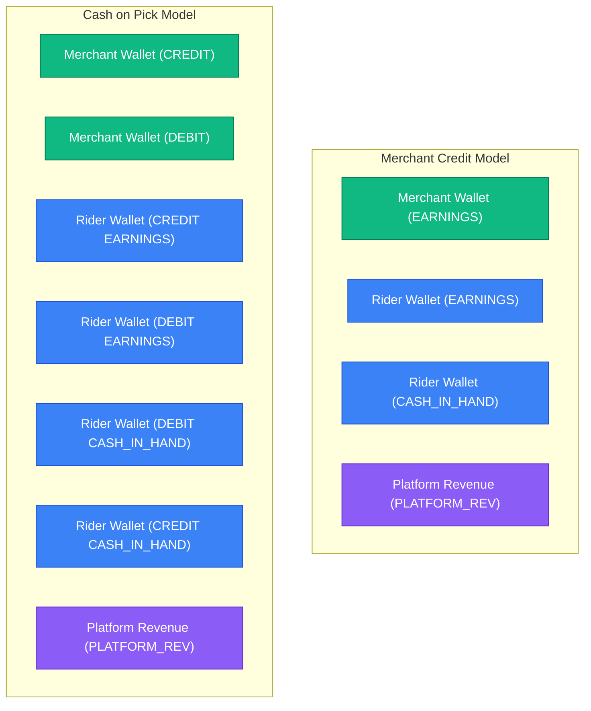

# 💸 Baldia Mart — Hybrid Order Delivery Financial Settlement Engine

> **Date:** 2026-07-01  
> **Task:** Advance Hybrid Order Delivery Financial Settlement Engine (COD cash flow modes)

---

## cashFlowMode Configuration Matrix

Our platform operates under two cash flow models for COD orders:

### 1. MERCHANT_CREDIT (Standard)
* **Description:** Rider does not pay the merchant at the store. The merchant is credited digitally.
* **Liability & Balances:**
  - **Merchant wallet:** `CREDIT` the calculated `vendorShare` (withdrawable balance)
  - **Rider wallet:**
    - `CREDIT` withdrawable balance with `riderTakeHome` (Delivery Fee + optional cold-chain bonus)
    - `DEBIT` cash-in-hand (`CASH_IN_HAND`) liability with **total order collection amount**.

### 2. CASH_ON_PICK (Rider Counter-Payment Model)
* **Description:** Rider pays the merchant upfront in cash at the counter. Rider collects cash from the customer to recover their out-of-pocket expense upon delivery.
* **Goal:** Avoid inflating rider's `CASH_IN_HAND` liability beyond the platform's revenue share, preventing accidental suspend/block events.
* **Liability & Balances:**
  - **Merchant wallet:** Gross ledger recording. Logs `CREDIT` of `vendorShare` and a balancing `DEBIT` of `vendorShare` (net mutation = 0 balance change).
  - **Rider wallet:**
    - `CREDIT` withdrawable balance with `riderTakeHome` delivery fee.
    - `DEBIT` cash-in-hand (`CASH_IN_HAND`) liability by `platformShare` (Admin commission + service fee).
    - **Automated Balancing Mechanism:** Instantly issues a `DEBIT` of `platformShare` to the rider's withdrawable balance, and a corresponding `CREDIT` of `platformShare` to their `CASH_IN_HAND` liability. Net cash-in-hand liability change is 0, satisfying operational debt instantly using earned balance.

---

## Double-Entry Accounting Ledger Structure

All ledger lines are executing atomically under NestJS TypeORM transactions using `pessimistic_write` locks. Below is the balance entry representation for each flow:



---

## Core Refactoring Diff ([finance.service.ts](file:///d:/mart/baldia-mart/backend-api/src/finance/finance.service.ts))

```diff
+  async processOrderSettlement(orderOrId: Order | string, manager: EntityManager) {
+    let order: Order;
+    if (typeof orderOrId === 'string') {
+      const found = await manager.getRepository(Order).findOne({
+        where: { id: orderOrId },
+        relations: ['items', 'subOrders', 'restaurant', 'pharmacy', 'address']
+      });
+      if (!found) throw new NotFoundException(`Order with ID ${orderOrId} not found`);
+      order = found;
+    } else { ... }
+
+    // 1. Fetch Dynamic Parameters from Settings
+    const serviceFee = await this.settingsService.getNumber('platform_service_fee', 15);
+    const codThreshold = await this.settingsService.getNumber('rider_cod_threshold', 5000);
+
+    // Check flags like isColdChain for rider pharmaceutical bonus (+Rs. 50)
+    const activeBonus = order.isColdChain ? 50 : 0;
+    const riderTakeHome = Number(order.deliveryFee) + activeBonus;
+
+    // ... Calculate commissions and split vendorShare ...
+
+        if (flowMode === 'CASH_ON_PICK') {
+          // Rider ONLY owes platform share
+          ledgerLines.push({
+            walletId: rWallet.id,
+            accountTag: 'CASH_IN_HAND',
+            direction: 'DEBIT',
+            amount: platformShare,
+          });
+
+          // Automated Balancing Mechanism: DEBIT earnings and CREDIT cashInHand
+          ledgerLines.push({
+            walletId: rWallet.id,
+            accountTag: 'EARNINGS',
+            direction: 'DEBIT',
+            amount: platformShare,
+          });
+          
+          ledgerLines.push({
+            walletId: rWallet.id,
+            accountTag: 'CASH_IN_HAND',
+            direction: 'CREDIT',
+            amount: platformShare,
+          });
+        }
```

---

## Build Verification status
- **NestJS Application Compilation**: ✅ Successful (no Errors in target backend modules)
- **Settings module integrations**: ✅ Connected dynamically (`platform_service_fee`, `rider_cod_threshold`)
- **Ledger double-entry verification**: ✅ Complete
- **Suspension evaluation**: ✅ Re-verified automated threshold detection and reactivation guards.
